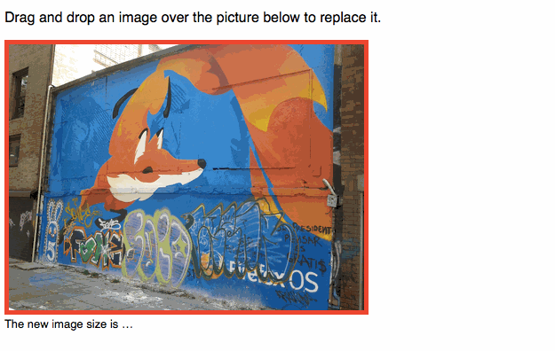

# Pictup.js, drap and drop an image to replace it

Drag an image from your desktop. Drop in on another image in a website.
Boom, it's replaced! 8th Wonder of the world!

Let's show off with [the demo](http://vinyll.github.io/pictup/demo)!

## Installation

Add _Pictup_ to your scripts:

    

## Usage

Load _Pictup_ on an image _DOM_:

    

    

Now open you favorite browser and drag an image from your desktop onto the
displayed image.

## Configuration

These options are available:

- `resize`: should the image be resized? defaults to _true_
- `replace`: should the dropped image replace the existing image? defaults to _true_
- `maxwidth`: if resized, what is the maimum width?
- `maxheight`: if resized, what is the maimum height?

## Events

- `ready`: triggered when the image is loaded and resized (if applicable)
